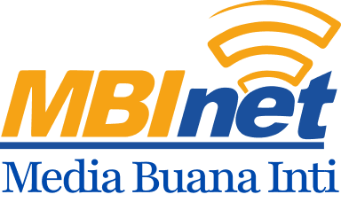

<p align="center">
  
</p>

<h1 align="center">🚀 MBI ISP — Frontend Application</h1>

<p align="center">
  <b>Modern, fast, and scalable frontend for MBI Internet Service Provider.</b><br/>
  Built with <b>Next.js</b>, <b>Ant Design</b>, and <b>Tailwind CSS</b>.
</p>

---

## 📌 Overview

**MBI ISP Frontend** is a web application built to support the internal and customer-facing workflows of **MBI Internet Service Provider**.

This project is part of a full ISP management ecosystem designed to handle:

- Customer subscriptions
- Package browsing & purchasing
- User dashboards
- Admin management
- Payment integrations (future)
- Automatic disconnection logic when customers miss payment (connected to backend Mikrotik automation)

The goal of this repository is to be **clean, maintainable, and scalable**, ensuring future developers can easily continue the project.

---

## ✨ Core Features

### 🛒 Customer Features

- Browse available internet packages
- Register & purchase subscriptions
- Manage account and profile
- View active package and status
- Track transaction history
- Receive payment reminders and notifications

### 🛠️ Admin Features

- Manage customers
- Manage internet packages
- View connection status & package history
- Dashboard overview
- Support tools for automation (Mikrotik, billing, reminders)

### 💻 Technical Features

- Fully responsive UI
- Reusable React components
- Centralized API integration
- Smooth UI/UX with Ant Design + Tailwind
- Automatic caching using SWR

---

## 🏗️ Project Structure (Simplified)

```
src/
│── app/               # Next.js routes & pages
│── components/        # Reusable UI components
│── contexts/          # Global state providers
│── hooks/             # Custom hooks
│── services/          # API services
│── utils/             # Helper utilities
│── styles/            # Global styles
public/
```

This allows:

- Clear separation of concerns
- Easy onboarding for new developers
- Stable long-term maintenance

---

## 🛠️ Technologies Used

| Category             | Technology    |
| -------------------- | ------------- |
| **Framework**        | Next.js 14    |
| **UI Library**       | Ant Design    |
| **Styling**          | Tailwind CSS  |
| **Data Fetching**    | SWR           |
| **State Management** | React Context |
| **Linting**          | ESLint        |
| **Formatting**       | Prettier      |

---

## 🚀 Getting Started

### Prerequisites

- Node.js (v18 or later)
- Yarn

### Installation

1. Clone the repository:

   ```bash
   git clone https://github.com/username/project-name.git
   ```

2. Install dependencies:

   ```bash
   yarn
   ```

3. Run development server:

   ```bash
   yarn dev
   ```

Visit:  
👉 `http://localhost:3000`

---

## 📝 Scripts

- `yarn dev` — Start development mode
- `yarn build` — Build for production
- `yarn start` — Start production server
- `yarn lint` — Run ESLint
- `yarn format` — Format code with Prettier

---

## 📚 Developer Guide

### 🔐 Authentication

- Token-based auth
- Tokens stored in cookies
- Auth context handles global login state

### 🌐 API Setup

All API calls are organized under `/services`.  
Set the environment variables:

```
NEXT_PUBLIC_API_URL=https://api.example.com
```

### 🎨 UI Guidelines

- Always use Ant Design components
- Combine Tailwind for spacing/layout
- Use reusable components from `/components`

### 🧩 Component Rules

- Keep components small and modular
- Avoid business logic in pages
- Use custom hooks for reusable logic

### 🛡️ Code Quality

- Follow ESLint rules
- Use Prettier before committing
- TypeScript is enforced for safety

---

## 📦 Deployment

### Recommended Options

- Docker (for self-hosting)
- Nginx (manual hosting)

### Build Production

```bash
yarn build
yarn start
```

---

## 🤝 Contributing

- Use feature branches (`feature/...`)
- Use clear commit prefixes (`feat:`, `fix:`, `refactor:`)
- Document new utilities or components
- Keep the project structure clean

---

## 👨‍💻 Author & Maintainers

This project is developed internally for **MBI ISP**  
Maintained by the engineering team & future developers in the company.

Welcome aboard! 🚀  
Please read the project structure and follow the guidelines for consistency.

---

&copy; Copyright 2025 MBI ISP. All rights reserved.
